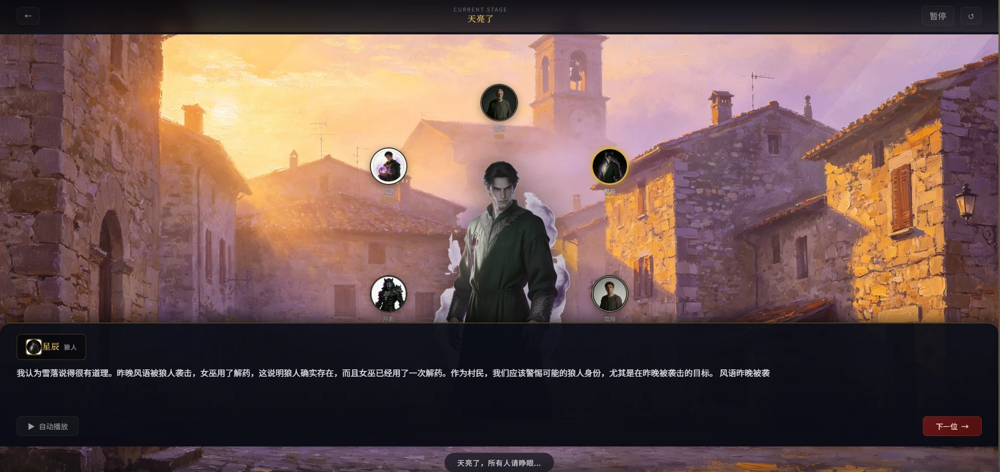

# AI 狼人杀游戏

一个基于 FastAPI 和 WebSocket 的 AI 狼人杀游戏，具有第五人格风格的 Gothic 界面。



## 功能特性

### 游戏机制
- **发言顺序轮转**：从上一轮死亡玩家的下一个人开始发言，增加游戏策略性
- **遗言机制**：死亡玩家可在第二天白天前发表遗言
- **内容可见性控制**：AI 只能看到已发言玩家的内容，无法窥探未来发言
- **结构化上下文**：AI 拥有清晰的游戏状态信息（发言顺序、已发言标记、夜间结果等）
- **暂停/继续功能**：支持游戏暂停和继续
- **MVP评选**：游戏结束后自动评选MVP玩家

### 角色系统
- 6 种角色：狼人、预言家、女巫、猎人、守卫、平民
- 优化的提示词：角色不会直接暴露身份，需要策略性发言
- 支持 6/8/10 人局
- 可自定义每个玩家的模型、性格和角色

### API 配置
- 支持多个模型供应商配置
- 后端统一管理 API Key（加密存储）和 API URL
- 前端验证：未配置 API 时无法开始游戏
- 支持测试供应商连接
- 支持获取可用模型列表

### 数据持久化
- **SQLite数据库**：完整记录每局游戏数据
- **游戏统计**：总场数、胜率、连胜、发言统计、击杀统计等
- **历史记录**：可查看完整的游戏历史记录
- **排行榜系统**：
  - MVP 排行榜
  - 模型胜率排行榜
- **成就系统**：13个成就等待解锁，包括首胜、速胜、角色大师等

### 考试系统
- 支持上传题库文件（.txt格式）
- 自动解析题目
- 可选择使用AI模型答题或用户手动答题
- 自动评分
- 支持多个题库文件管理

### 多房间支持
- 支持同时运行多局游戏
- 每个房间有独立的游戏状态
- WebSocket 连接令牌认证（可选）
- 速率限制保护

## 技术栈

### 后端
- **FastAPI** - Web 框架和 WebSocket 支持
- **Pydantic** - 数据验证
- **Pytest-asyncio** - 异步测试
- **SQLite** - 数据持久化
- **cryptography** - API Key 加密存储
- **httpx** - 异步HTTP客户端

### 前端
- **原生 JavaScript** - 无框架依赖
- **Tailwind CSS** - 本地构建（生产环境优化）
- **Font Awesome** - 图标
- **Google Fonts** - MedievalSharp &amp; Playfair Display 字体

## 项目结构

```
d:/project/AI Werewolf Game/
├── app.py                      # FastAPI 应用入口
├── game_manager.py            # 多房间游戏管理器
├── db.py                       # SQLite 数据库管理
├── crypto.py                   # 加密解密模块
├── logger.py                   # 日志模块
├── exam.py                     # 考试系统模块
├── game/
│   ├── engine.py              # 游戏核心引擎
│   ├── ai_player.py           # AI 玩家逻辑
│   ├── voice_player.py        # 语音播放
│   ├── roles.py               # 角色定义和配置
│   ├── night_phase.py         # 夜间阶段逻辑
│   ├── day_phase.py           # 白天阶段逻辑
│   ├── mvp.py                 # MVP 评选逻辑
│   ├── llm_client.py          # LLM 客户端
│   ├── context_builder.py     # 上下文构建
│   ├── action_parser.py       # 动作解析
│   ├── error_handler.py       # 错误处理
│   ├── text_utils.py          # 文本工具
│   └── config.py              # 游戏配置常量
├── static/
│   ├── index.html             # 主页面
│   ├── exam.html              # 考试页面
│   ├── app.js                 # 前端逻辑
│   ├── css/
│   │   └── style.css          # 构建后的 CSS（本地）
│   └── src/
│       └── input.css          # CSS 源文件
├── tests/                     # 测试套件
├── data/
│   ├── config.json            # API 配置（加密）
│   ├── game.db                # SQLite 数据库
│   └── .enc_key              # 加密密钥
├── logs/                     # 游戏日志
├── package.json              # Node.js 依赖
├── tailwind.config.js        # Tailwind 配置
├── postcss.config.js         # PostCSS 配置
├── requirements.txt          # Python 依赖
└── README.md                 # 本文档
```

## 安装和运行

### 1. 安装 Python 依赖

```bash
pip install -r requirements.txt
```

### 2. 安装 Node.js 依赖（用于构建 CSS）

```bash
npm install
```

### 3. 构建 CSS

```bash
npm run build:css
```

开发模式下可以监听文件变化自动构建：

```bash
npm run watch:css
```

### 4. 启动后端服务

```bash
python app.py
```

或使用 uvicorn：

```bash
uvicorn app:app --reload
```

服务将在 `http://localhost:8000` 启动。

### 5. 访问游戏

打开浏览器访问：`http://localhost:8000`

访问考试页面：`http://localhost:8000/exam`

## 配置 API

1. 点击页面上的"设置"按钮
2. 添加模型供应商配置（名称、API Key、API Base URL、模型名称）
3. 点击"测试连接"验证配置
4. 点击"保存配置"
5. 配置会自动加密存储到 `data/config.json`

**注意**：必须至少配置一个有效的 API 供应商才能开始游戏。

## 运行测试

```bash
# 运行所有测试
pytest tests/ -v

# 运行特定测试文件
pytest tests/test_ai_player.py -v

# 快速运行
pytest tests/ -q
```

## 开发说明

### CSS 构建流程

1. 修改 `static/src/input.css`
2. 运行 `npm run build:css` 生成 `static/css/style.css`
3. 刷新浏览器查看效果

### 添加新角色

在 `game/roles.py` 中的 `ROLE_INFO` 和 `GAME_CONFIGS` 添加角色定义。

### 调试日志

游戏日志位于 `logs/game.log`，错误日志位于 `logs/error.log`。

### 环境变量

- `ALLOWED_ORIGINS`: CORS 允许的源（逗号分隔）
- `IS_PRODUCTION`: 是否为生产环境（true/false）
- `WS_AUTH_TOKEN`: WebSocket 连接认证令牌
- `DEPLOY_ENV`: 部署环境（production等）

## 已解决的问题

### 游戏机制
- ✅ 发言顺序固定问题（改为轮转）
- ✅ 缺少死亡玩家遗言
- ✅ AI 看到未来发言（内容泄露）
- ✅ AI 上下文管理混乱（记忆不清晰）

### 前端问题
- ✅ Tailwind CSS CDN 生产环境警告（改为本地构建）
- ✅ 内联样式分散（全部迁移到 CSS 文件）
- ✅ localStorage 与后端配置不一致（统一使用后端 API）
- ✅ loadLocalStorage 未定义错误
- ✅ 音频元素未定义导致初始化失败（添加 audio 元素）
- ✅ 供应商管理代码冲突（删除重复的 addNewProvider 函数）
- ✅ 供应商数据字段不一致（统一使用 api_key、api_url、default_model）

### API 验证
- ✅ 未配置 API 仍可点击开始游戏（已添加前后端验证）

### 架构优化
- ✅ 单例模式改为多房间支持
- ✅ 添加数据持久化
- ✅ 实现成就和排行榜系统
- ✅ 添加考试系统
- ✅ API Key 加密存储

## API 端点

### 配置管理
- `GET /api/config` - 获取供应商配置
- `POST /api/config/provider` - 保存供应商配置
- `DELETE /api/config/provider/{provider_id}` - 删除供应商
- `POST /api/config/test-provider` - 测试供应商连接
- `POST /api/config/list-models` - 获取模型列表

### 游戏
- `GET /api/game-configs` - 获取游戏配置
- `GET /api/game-status` - 获取游戏状态
- `WS /ws` - WebSocket 游戏连接

### 考试
- `GET /api/exam/files` - 获取题库文件列表
- `GET /api/exam/questions` - 获取题目列表
- `POST /api/exam/upload` - 上传题库文件
- `GET /api/exam/question/{question_id}` - 获取单个题目
- `POST /api/exam/answer` - 提交答案并评分

### 统计与排行榜
- `GET /api/stats/summary` - 获取游戏统计摘要
- `GET /api/stats/history` - 获取游戏历史记录
- `GET /api/stats/wins-by-role` - 获取各角色胜场统计
- `GET /api/stats/wins-by-mode` - 获取各模式胜场统计
- `GET /api/leaderboard/mvp` - 获取 MVP 排行榜
- `GET /api/leaderboard/models` - 获取模型胜率排行榜

### 成就系统
- `GET /api/achievements` - 获取所有成就
- `POST /api/achievements/check` - 检查成就解锁

### 数据库管理
- `POST /api/db/cleanup` - 清理过期数据库记录

## 许可证

MIT License
